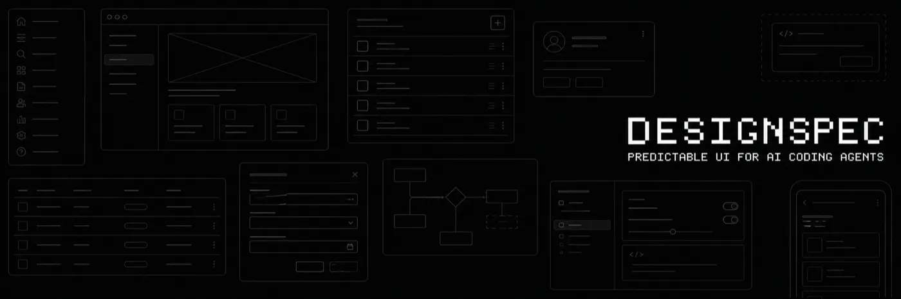

<p align="center">
  
</p>

<p align="center">
  <a href="README.md">English</a> | <a href="README.ko.md">한국어</a>
</p>

<p align="center">
  <a href="https://www.npmjs.com/package/@tjdals12/design-spec"></a>
  <a href="https://www.npmjs.com/package/@tjdals12/design-spec"></a>
  <a href="https://github.com/tjdals12/DesignSpec/actions/workflows/ci.yml"></a>
  <a href="LICENSE"></a>
</p>

<p align="center">
  <strong>에이전트에게 화면을 맡길 때마다 디자인이 달라지나요?</strong>
</p>

AI 에이전트에게 프론트엔드를 맡겨보면 금방 느끼게 됩니다. 같은 걸 시켜도 결과가 매번 다릅니다. 어떤 정보를 보여줄지, 어떤 버튼을 둘지, 레이아웃을 어떻게 잡을지가 그때그때 달라지죠.

DesignSpec은 그 결과를 예상한 대로 나오게 만듭니다. 코드를 짜기 전에 "이 화면은 이래야 한다"를 먼저 고정해두면, 에이전트는 상상으로 채우지 않고 그 기준대로 화면을 만듭니다. 무엇을 보여주고, 무엇을 할 수 있고, 어떻게 배치할지를 미리 정해두니, 머릿속에 그린 화면과 실제 결과가 어긋나지 않습니다.

색·간격·타이포그래피 같은 스타일도 함께 정해두기 때문에, 화면마다 디자인이 달라지지 않습니다.

## 목차

- [시작하기](#시작하기)
- [워크플로우](#워크플로우)
- [구조](#구조)
- [프로젝트 컨텍스트](#프로젝트-컨텍스트)
- [스킬](#스킬)
- [CLI 명령어](#cli-명령어)
- [License](#license)

## 시작하기

**Node.js 22.13 이상이 필요합니다.**

DesignSpec을 전역에 설치합니다.

```bash
npm install -g @tjdals12/design-spec
```

Prerelease 버전을 설치하려면:

```bash
npm install -g @tjdals12/design-spec@next
```

프로젝트 디렉터리로 이동해 초기화합니다.

```bash
cd your-project
design-spec init --tools=all
```

`--tools`로 사용할 에이전트를 지정합니다. 전부 설치하려면 `all`, 일부만 설치하려면 `claude,codex`처럼 값을 콤마로 묶습니다. 지원하는 에이전트는 다음과 같습니다.

| 에이전트       | `--tools` 값  | 스킬 경로        |
| -------------- | ------------- | ---------------- |
| Claude Code    | `claude`      | `.claude/skills` |
| Codex          | `codex`       | `.agents/skills` |
| Antigravity    | `antigravity` | `.agents/skills` |
| Cursor         | `cursor`      | `.agents/skills` |
| GitHub Copilot | `copilot`     | `.agents/skills` |
| OpenCode       | `opencode`    | `.agents/skills` |
| Grok           | `grok`        | `.grok/skills`   |

초기화하면 에이전트에서 쓸 스킬이 생성됩니다. 실제 작업 흐름은 아래 [워크플로우](#워크플로우)를 참고하세요.

## 워크플로우

회원가입 화면을 만든다고 해봅시다.

**최초 1회:**

```text
/desx-style-init
```

**필요할 때:**

```text
/desx-explore
```

**change마다:**

```text
/desx-new → (/desx-continue | /desx-ff) → /desx-apply → /desx-verify → /desx-sync → /desx-archive
```

먼저 `/desx-style-init`으로 프로젝트의 스타일 가이드라인을 한 번 잡아둡니다. 이후 모든 작업이 이 기준을 따릅니다.

무엇을 만들지 아직 분명하지 않다면 `/desx-explore`로 먼저 생각을 정리할 수 있습니다.

`/desx-new`로 change를 시작하고 화면별 요구사항을 아티팩트로 작성합니다. 하나씩 검토하며 가려면 `/desx-continue`, 한 번에 만들려면 `/desx-ff`를 씁니다. 회원가입 change라면 이런 구조가 만들어집니다.

```text
design-spec/changes/add-signup/
├── proposal.md
├── screens.md
├── pages/
│   └── signup.md
├── components/
│   └── signup-form.md
└── tasks.md
```

요구사항이 준비되면 `/desx-apply`로 구현하고, `/desx-verify`로 결과가 아티팩트와 맞는지 확인합니다. 마지막으로 `/desx-sync`로 스펙을 마스터 스펙에 반영하고 `/desx-archive`로 change를 보관합니다.

이렇게 요구사항을 먼저 고정한 뒤 구현으로 넘어가기 때문에, 화면이 처음 의도한 대로 만들어집니다.

## 구조

DesignSpec의 파일은 `design-spec/` 아래에 있고, 크게 두 영역으로 나뉩니다.

- `changes/` — 진행 중인 작업입니다. 하나의 change가 하나의 작업 단위이고, 관련된 화면과 공통 컴포넌트를 함께 담습니다.
- `specs/` — 확정된 디자인 스펙이 누적되는 곳입니다. change를 마치면 그 결과가 여기에 반영되어, 프로젝트의 현재 디자인 기준이 됩니다.

하나의 change는 아래 아티팩트로 구성됩니다.

```text
design-spec/changes/<change-name>/
├── proposal.md      # 이 change가 왜 필요한가
├── screens.md       # 어떤 페이지와 공통 컴포넌트가 포함되는가
├── pages/           # 페이지별 디자인 요구사항
│   └── <page>.md
├── components/      # 공통 컴포넌트별 디자인 요구사항
│   └── <component>.md
└── tasks.md         # 구현 작업 목록
```

- **proposal.md** — 이 change가 왜 필요한지. Why / What Changes / Impact로 가볍게 정리합니다.
- **screens.md** — 이번 change에 포함되는 페이지와 공통 컴포넌트의 목록입니다.
- **pages/\*.md** — 페이지별 요구사항. 무엇을 보여주고, 어떤 액션을 제공하고, 어떻게 배치하고, 어떤 상태를 다루는지.
- **components/\*.md** — 여러 페이지가 함께 쓰는 컴포넌트의 요구사항.
- **tasks.md** — 위 아티팩트를 바탕으로 한 구현 작업 체크리스트.

## 프로젝트 컨텍스트

`init`을 실행하면 `design-spec/config.yaml`이 함께 생성됩니다. 여기에 서비스 개요나 프로젝트 도메인처럼, 화면을 디자인하고 구현할 때 알고 있어야 할 배경을 적어둡니다. 적어둔 내용은 아티팩트를 만들거나 구현할 때마다 컨텍스트에 주입됩니다. 기술 스택이나 코딩 규칙은 `CLAUDE.md`, `AGENTS.md` 같은 파일이 더 적합합니다.

- `context` — 파일에 직접 적는 짧은 메모. 서비스 개요, 도메인 용어 등.
- `contextFiles` — 이미 있는 마크다운 문서의 경로. 그 내용을 그대로 가져옵니다.

```yaml
context: |
  가계부 서비스. 사용자가 지출을 기록하고 월별로 예산을 관리한다.
  핵심 용어: 거래, 카테고리, 예산.

contextFiles:
  - docs/service-overview.md
```

설정한 내용은 `design-spec context`로 확인할 수 있습니다.

## 스킬

이 스킬들은 AI 코딩 어시스턴트의 채팅에서 호출합니다. `init`이 설정한 에이전트마다 설치하며, 각 스킬은 `/desx-new`처럼 이름으로 호출합니다.

### `/desx-style-init`

대화를 통해 프로젝트의 스타일 가이드라인을 작성합니다. 색·간격·타이포그래피 기준을 정해 `design-spec/styles/`에 저장하고, 이후 모든 아티팩트 작성과 구현에 주입됩니다. 프로젝트당 한 번 실행합니다.

```text
/desx-style-init
```

### `/desx-explore`

무엇을 만들지 아직 분명하지 않을 때, 대화로 아이디어와 요구사항을 구체화합니다.

```text
/desx-explore [탐색할 주제]
```

### `/desx-new`

새 change를 생성합니다. 작업할 화면과 컴포넌트를 담을 디렉터리를 만듭니다.

```text
/desx-new [change 이름 또는 설명]
```

### `/desx-continue`

change의 다음 아티팩트를 하나씩 차례로 작성합니다.

```text
/desx-continue [change 이름]
```

### `/desx-ff`

필요한 아티팩트를 한 번에 작성합니다.

```text
/desx-ff [change 이름 또는 설명]
```

### `/desx-apply`

아티팩트와 스타일 가이드라인을 기준으로 화면을 구현합니다.

```text
/desx-apply [change 이름]
```

### `/desx-verify`

구현이 아티팩트의 요구사항과 맞는지 검증합니다.

```text
/desx-verify [change 이름]
```

### `/desx-sync`

change의 페이지·컴포넌트 스펙을 마스터 스펙에 반영합니다.

```text
/desx-sync [change 이름]
```

### `/desx-archive`

완료된 change를 보관합니다.

```text
/desx-archive [change 이름]
```

## CLI 명령어

`design-spec` CLI는 프로젝트 초기화, change 생성과 상태 확인, 아티팩트 지시문과 컨텍스트 출력을 위한 터미널 명령을 제공합니다. 앞의 [스킬](#스킬)에서 다룬 스킬과 함께 쓰입니다. 모든 명령은 대상 경로를 인자로 받으며, 생략하면 현재 디렉터리를 사용합니다.

### `design-spec init`

프로젝트를 초기화하고 스킬을 생성합니다.

```text
design-spec init [path] --tools <tools>
```

| 옵션              | 설명                                                                       |
| ----------------- | -------------------------------------------------------------------------- |
| `--tools <tools>` | 설치할 에이전트. `all`, `none`, 또는 `claude,codex`처럼 콤마로 지정 (필수) |

### `design-spec list`

활성 change와 스펙 목록을 보여줍니다.

```text
design-spec list [path] [options]
```

| 옵션        | 설명                               |
| ----------- | ---------------------------------- |
| `--changes` | change 목록 (옵션이 없으면 기본값) |
| `--specs`   | 스펙 목록                          |
| `--json`    | JSON으로 출력                      |

### `design-spec status`

change의 아티팩트 완료 상태를 보여줍니다.

```text
design-spec status [path] --change <id>
```

| 옵션            | 설명             |
| --------------- | ---------------- |
| `--change <id>` | 대상 change 이름 |
| `--json`        | JSON으로 출력    |

### `design-spec new`

새 change를 생성합니다.

```text
design-spec new [path] --change <id>
```

| 옵션            | 설명               |
| --------------- | ------------------ |
| `--change <id>` | 생성할 change 이름 |

### `design-spec artifact-instructions`

특정 아티팩트를 작성하기 위한 지시문을 출력합니다.

```text
design-spec artifact-instructions [path] --change <id> --artifact <id>
```

| 옵션              | 설명                                      |
| ----------------- | ----------------------------------------- |
| `--change <id>`   | 대상 change 이름                          |
| `--artifact <id>` | 아티팩트 이름 (예: `proposal`, `screens`) |
| `--json`          | JSON으로 출력                             |

### `design-spec apply-instructions`

구현 단계의 지시문을 출력합니다.

```text
design-spec apply-instructions [path] --change <id>
```

| 옵션            | 설명             |
| --------------- | ---------------- |
| `--change <id>` | 대상 change 이름 |
| `--json`        | JSON으로 출력    |

### `design-spec design-instructions`

change의 컴포넌트와 페이지 전체를 담은 디자인 프롬프트를 출력합니다. 디자인 도구에서 디자인을 확인할 때 씁니다.

```text
design-spec design-instructions [path] --change <id>
```

| 옵션            | 설명             |
| --------------- | ---------------- |
| `--change <id>` | 대상 change 이름 |
| `--json`        | JSON으로 출력    |

### `design-spec context`

프로젝트 컨텍스트와 스타일 시스템을 출력합니다.

```text
design-spec context [path]
```

| 옵션     | 설명          |
| -------- | ------------- |
| `--json` | JSON으로 출력 |

## License

이 프로젝트는 MIT License로 배포됩니다. 전문은 [LICENSE](LICENSE)에서 확인할 수 있습니다.
